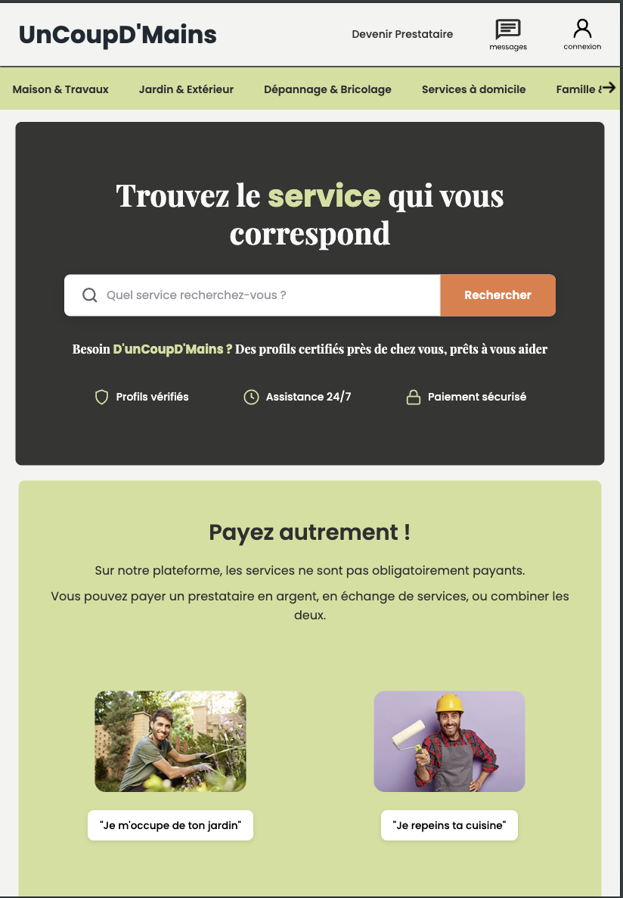
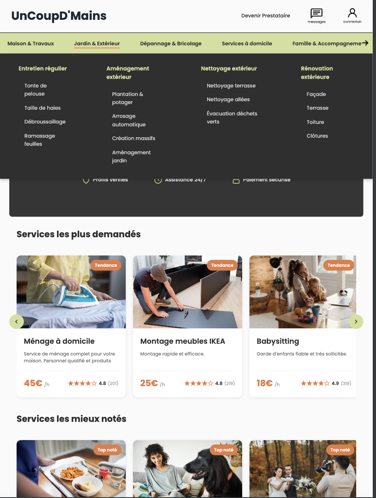
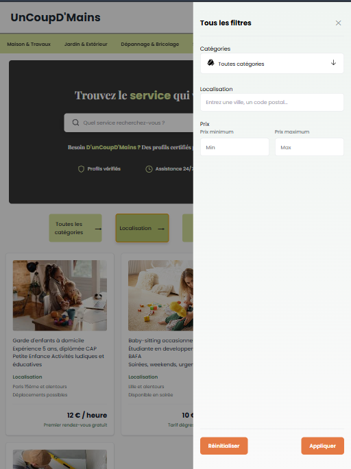
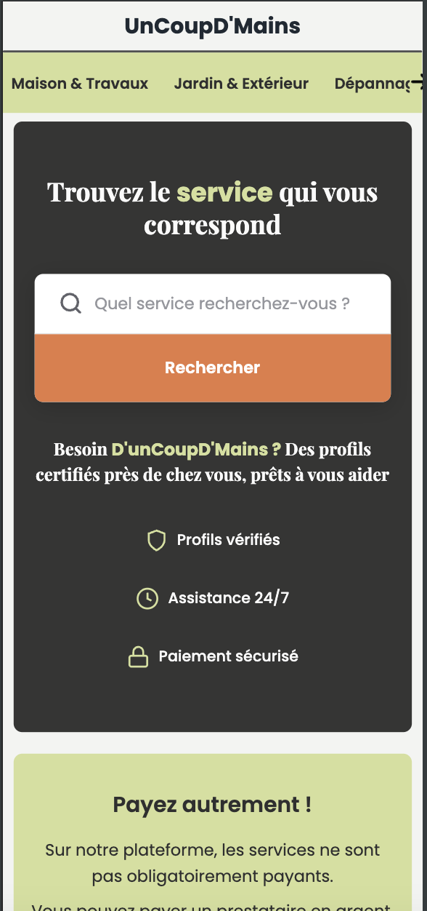
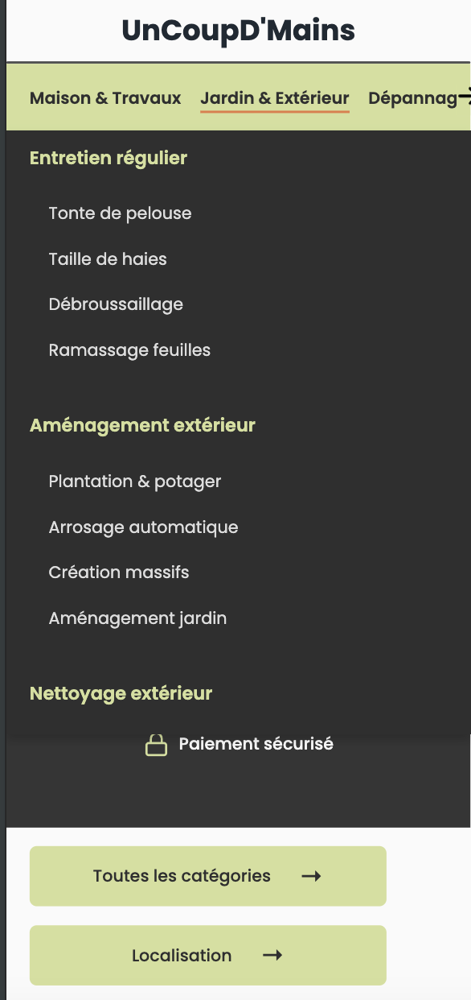
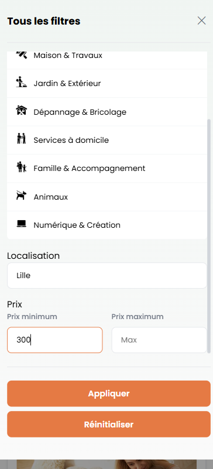

# 🤝 UnCoupD'Mains

> **Plateforme de mise en relation pour services de proximité**
> Projet d'apprentissage en binôme – Formation DWWM

---

## 🧭 Présentation du projet

**UnCoupD'Mains** est une plateforme web dédiée aux **services de proximité**, permettant de mettre en relation des particuliers avec des prestataires locaux.

La spécificité du projet repose sur un **système de paiement flexible** :

* 💶 Paiement en argent
* 🔁 Échange de services
* 🤝 Combinaison des deux

🎓 **Contexte pédagogique**
Projet réalisé en **binôme** dans le cadre de la formation **Développeur Web et Web Mobile (DWWM)**.

👨‍💻 **Périmètre de ce repository**
Ce dépôt contient **uniquement mes pages personnelles** du projet.

J’ai assuré **de A à Z** sur ces pages :

* 🎨 Le **maquettage Figma** (wireframes, moodboard, charte graphique)
* 🧠 La **conception UI/UX**
* 💻 Le **développement frontend complet** en **HTML, CSS et JavaScript Vanilla**

---
## 🖼️ Aperçu du projet

> 📸 *Captures d’écran et GIFs de démonstration du projet*

### Pages principales
<p style="display: flex; gap: 15px; flex-wrap: wrap;">
  
  
  
</p>

### Composants et responsive
<p style="display: flex; gap: 15px; flex-wrap: wrap;">
  
  
  
</p>

*(Les visuels seront ajoutés progressivement)*

---

## 🗂️ Pages du site

### 🟢 Page 1 – Accueil (`index.html`)

* Hero section avec barre de recherche
* Présentation du concept et du paiement flexible
* Mise en avant des abonnements
* Section avis clients
* Footer complet

---

### 🟡 Page 2 – Services (`service.html`)

* Présentation des catégories de services
* Navigation par carrousel
* Mise en contexte avant la recherche avancée

> ℹ️ Cette page sert de **transition** entre l’accueil et la recherche détaillée.

---

### 🔵 Page 3 – Recherche & Filtres (`filter.html`)

👉 **Cœur fonctionnel du projet frontend**

* Cartes de prestataires **dynamiques**
* Sidebar de filtres
* Filtrage en temps réel sans rechargement
* Carrousel de services

Les éléments suivants sont **entièrement gérés en JavaScript** sur cette page :

* Génération et affichage des cartes
* Filtrage par attributs `data-*`
* Recherche dynamique

---

## ✨ Fonctionnalités implémentées

### 🧭 Navigation & UI

* Menu déroulant interactif avec sous-menus
* Barre de recherche intuitive
* Animations CSS fluides
* Interface moderne et épurée

### 🔍 Système de filtres (page `filter.html`)

* Filtrage par :

  * Catégorie
  * Prix
  * Localisation
* Utilisation des attributs HTML `data-category`, `data-price`, `data-location`
* Mise à jour dynamique de l’affichage

### 🎠 Carrousel

* Navigation horizontale fluide
* Boutons gauche / droite
* Scroll automatique

---

## 🛠️ Stack technique

### Technologies utilisées

* **HTML5** – Structure sémantique
* **CSS3** – Flexbox, Grid, animations, responsive
* **JavaScript Vanilla** – DOM, events, logique applicative
* **Figma** – Maquettage et prototypage

### Choix techniques

Le projet a été volontairement développé **sans framework CSS** afin de :

* Consolider les fondamentaux
* Maîtriser Flexbox et Grid
* Développer une vraie autonomie technique

---

## 📱 Responsive Design

Le site est pensé **mobile-first** et optimisé pour :

* 📱 Mobile : `< 480px`
* 📱 Mobile large : `481px – 768px`
* 💻 Tablette : `769px – 1024px`
* 🖥️ Desktop : `> 1024px`

### Breakpoints utilisés

```css
@media (max-width: 1024px) { /* Tablette */ }
@media (max-width: 768px)  { /* Mobile large */ }
@media (max-width: 480px)  { /* Mobile */ }
```

---

## 🎨 Identité visuelle

### Palette de couleurs

```css
--primary: #d4e09b;      /* Vert clair */
--secondary: #e57a44;    /* Orange CTA */
--dark: #2f2f2f;         /* Texte foncé */
--light: #fafafa;        /* Texte clair */
--background: #f1f2f0db; /* Fond */
```

### Typographies

* **Poppins** – Texte principal
* **Playfair Display** – Titres et accents

---

## 📂 Structure du projet

```
UnCoupDMains/
│
├── README.md
├── assets/
│   └── img/
│
├── css/
│   ├── c_accueil.css
│   └── c_filter.css
│
├── js/
│   ├── c_accueil.js
│   └── c_filter.js
│
└── pages/
    ├── index.html
    ├── service.html
    └── filter.html
```

---

## 🚀 Installation

```bash
git clone https://github.com/votre-username/UnCoupDMains.git
cd UnCoupDMains
```

Puis ouvrir `index.html` ou utiliser **Live Server**.

---

## 🔮 Pistes d’amélioration (v2)

### UI / UX

* Menu burger mobile
* Pagination des résultats
* Amélioration accessibilité (WCAG 2.1)

### Fonctionnalités

* Authentification utilisateur
* Tableau de bord personnel
* Messagerie interne
* Paiement en ligne (Stripe / PayPal)

### Backend (à venir)

* API REST (Node.js / Express)
* Base de données (MySQL ou MongoDB)
* Sécurité (JWT, validation des données)

---

## 🎓 Compétences développées

### Hard Skills

* HTML sémantique
* CSS avancé (Grid, Flexbox, responsive)
* JavaScript Vanilla
* UI/UX Design
* Git & GitHub

### Soft Skills

* Travail en binôme
* Organisation de projet
* Autonomie
* Apprentissage continu

---

## 👨‍💻 Auteur

**Charlie Wanlin**
Développeur Web & Web Mobile (DWWM)

* 📧 Email : [charliewanlin.pro@gmail.com](charliewanlin.pro@gmail.com)
* 💼 LinkedIn : [https://www.linkedin.com/in/charlie-wanlin-166748384/](https://www.linkedin.com/in/charlie-wanlin-166748384/)

---

## 📄 Licence

Projet sous licence **MIT**.

---

⭐ *N’hésitez pas à star le projet s’il vous a été utile ou inspirant.*
